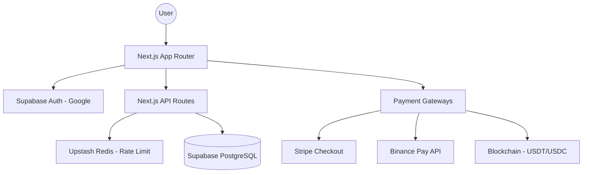

# Engineering Handover: Saidpiece Travel

## 1. Project Overview
**Saidpiece Travel** is a premium travel platform focused on luxury and immersive journeys to Bhutan. It features a modern, responsive interface, a sophisticated booking engine with multiple payment support (Stripe, Crypto, Binance Pay), and a comprehensive admin management system.

- **Primary Goal**: Provide a high-end booking experience for curated Bhutanese tours.
- **Target Users**: Luxury travelers, crypto-native enthusiasts, and boutique tour seekers.
- **Environment**: Next.js App Router (16.1.6), hosted on Vercel, with Supabase as the backend.

---

## 2. Tech Stack
| Category | Technology |
| :--- | :--- |
| **Framework** | Next.js 16 (Canary), React 19 |
| **Language** | TypeScript |
| **Backend / DB** | Supabase (PostgreSQL + Auth) |
| **Styling** | Tailwind CSS 4, CSS Modules |
| **Payments** | Stripe (Hosted), Binance Pay API, On-chain (Wagmi/Viem) |
| **Security** | Upstash Redis (Rate Limiting), Zod (Validation), Supabase RLS |
| **State/Data** | React Hooks, TanStack Query |

---

## 3. Folder / Codebase Structure
The project follows the standard Next.js App Router structure with localized components and logic.

- `src/app/`: Core routing and page logic.
  - `admin/`: All administrative dashboards and management tools.
  - `api/`: Serverless functions (Binance, Enquiries, Crypto Intents).
  - `confirm-pay/`: The central checkout logic.
  - `trip-detail/[slug]/`: Dynamic trip information pages.
- `src/components/`: Reusable UI elements.
  - `Header.tsx` & `Footer.tsx`: Universal navigation.
  - `admin/`: Admin-specific UI (Table views, Forms).
- `src/lib/`: Core services and shared utilities.
  - `supabaseClient.ts`: Public Supabase initialized for frontend.
  - `supabaseAdmin.ts`: Secret Supabase client for server-side logic (Bypasses RLS).
  - `apiSecurity.ts`: Centralizes rate limiting and security headers.
  - `cryptoPayments.ts`: Logic for handling Web3 transactions.
- `supabase/`: Local copies of migrations and schema definitions.

---

## 4. System Architecture Overview

---

## 5. Database Documentation
The database is managed via Supabase. Key tables include:

### Core Content
- **`trips`**: Stores main journey details (slug, title, price, duration, level, image_url).
- **`trip_itineraries`**: Day-by-day itinerary descriptions linked via `trip_id`.
- **`destinations`**: Regional/Valley information for browse filters.
- **`faqs`**: Question/Answer data for the help center.

### User & Interaction
- **`profiles`**: Extends Supabase `auth.users` with `role` (Admin/Customer) and `full_name`.
- **`enquiries`**: Lead capture table for general requests and booking interests.

### Payments & Tracking
- **`crypto_payment_intents`**: Tracks status and quotes for on-chain payments.
- **`blockchain_bookings`**: Links verified on-chain transactions to specific trip bookings.
- **`audit_logs`**: System-wide logging for administrative actions.

> [!IMPORTANT]
> **RLS Policies**: Most tables have Row Level Security enabled. Customer profiles should only be editable by the owner, while admin tables (`trips`, `blog_posts`) are only writable by users with the `admin` role in `profiles`.

---

## 6. Authentication and Authorization
- **Provider**: Google OAuth via Supabase.
- **Flow**:
  1. User clicks login -> `signInWithGoogle` hook.
  2. Redirects to `/auth/callback?next=...`.
  3. Callback handler exchanges code and redirects to the intended page.
- **Authorization**:
  - The `useAuth` hook fetches the `role` from the `profiles` table.
  - **Admin Access**: Verified using the `role === 'admin'` check and cross-referenced with hardcoded staff emails in `.env` for redundancy.

---

## 7. Feature-by-Feature Breakdown
### Trip Exploration
- **Path**: `/browse` and `/trip-detail/[slug]`.
- **Logic**: CSR (Client Side Rendering) with Supabase queries. Itinerary is fetched dynamically based on the trip's UUID.

### Multi-Channel Payment System
- **Path**: `/confirm-pay`.
- **Channels**:
  - **Stripe**: Redirects to a pre-defined Stripe Payment Link.
  - **Binance Pay**: Server-side integration using `binancePay.ts` to generate checkout URLs.
  - **On-chain Crypto**: Uses `Wagmi` for wallet connection. Supports USDT/USDC on multiple chains. Intent is saved to `crypto_payment_intents` before transaction execution.

### Admin Dashboard
- **Path**: `/admin`.
- **Features**: CRUD for Trips, FAQ, Destinations, and Blog.
- **Special Tool**: `/admin/import` provides a "Sync Manager" to re-seed architectural data if the environment is reset.

---

## 8. Step-by-Step User Flows
### The Booking Journey
1. **Browse**: User selects a trip from the catalog.
2. **Review**: User clicks "Confirm Booking" (redirects from trip detail).
3. **Auth Check**: If not logged in, redirects to Google Login, then back to `/confirm-pay`.
4. **Checkout Step 1 (Review)**: User confirms trip name, amount, and traveler name.
5. **Checkout Step 2 (Method)**: User selects Card, Crypto, Binance, or Wire.
6. **Checkout Step 3 (Secure Pay)**:
   - *Card*: Redirect to Stripe.
   - *Crypto*: Wallet connection -> Token approval/payment -> Indexer verification.
7. **Success**: User is shown the `SuccessView` with transaction details.

---

## 9. API / Service Layer Explanation
- **`/api/enquiries`**: Handles lead capture with Zod validation and strict rate limiting (3 requests / 10 mins).
- **`/api/binance-pay`**: Securely communicates with Binance API using server-side keys (HMAC signatures).
- **`apiSecurity.ts`**: Provides `enforceRateLimit` utility (Upstash Redis) used across all POST/PUT routes.

---

## 10. Known Risks & Fragile Areas
- **Stripe Redirection**: Current implementation uses static Stripe links. Dynamic pricing from the DB is not yet synced back to Stripe metadata automatically.
- **Indexer Delay**: On-chain payments rely on a backend indexer to verify transactions. Users may experience a slight delay (10-30s) before success confirmation.
- **Environment Variables**: The project is highly dependent on a specific set of `.env` variables (Upstash, Supabase, Binance). Ensure these are backed up.

---

## 11. Recommendations for Future Engineers
- **Start Here**: Read `src/lib/supabaseClient.ts` and the `useAuth` hook.
- **Components**: Most UI is built with Tailwind 4. Avoid adding legacy CSS files; keep styles modular.
- **Database Changes**: Use the Supabase CLI for migrations to keep local and remote schemas in sync.

---

## 12. Safe Change Guide
1. **Adding a New Trip Type**:
   - Update `profiles` user role if needed.
   - Add new trip to `trips` table via Admin Dashboard.
2. **Updating Booking Flow**:
   - Primary logic is in `src/app/confirm-pay/page.tsx`.
   - Payment-specific components are in `confirm-pay/components`.
3. **API Hardening**:
   - Always use `jsonNoStore` from `lib/apiSecurity` to avoid sensitive data being cached by Vercel's edge network.

---

## Final Summary
Saidpiece Travel is a highly specialized travel portal combining modern web tech with Web3 capabilities. Its security-first architectural approach (rate limiting, server-side validation) makes it robust for production use.
